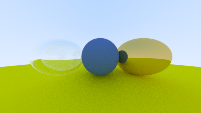

## 01-hello.png

## 02-libs.png

## 04-ray-sky.png

## 05-red-spehre.png

## 06-norm-vectors.png

## 07-world.png

## 08-antialiasing.png

## 09-matte.png

## 10-matte-gamma-corrected.png

## 11-fix-shadow-acne.png

## 12-true-lambertian-reflection.png

## 13-materials.png

## 14-rough-surface-metal.png

## 15-glass-sphere.png

## 16-corrected-glass-sphere.png

## 17-corrected-glass-sphere-original.png

## 18-schlick-approximation.png

## 19-hollow-glass.png

## 20-wide-angle-camera.png

## 21-distant-view.png

## 22-close-view.png

## 23-lens-camera.png

## 24-final.png

